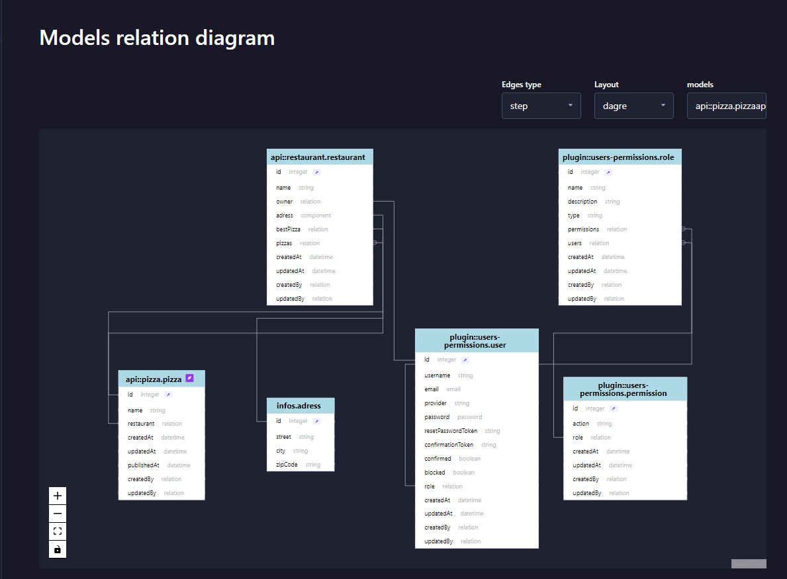

# Strapi plugin models-relation-diagram

Entity Relationship Diagram => BETA Version

[](https://www.npmjs.com/package/strapi4-models-relation-diagram)
[](https://github.com/PaulRichez/strapi4-plugin-route-permission/blob/main/Licence)

Create a diagram of your tables



## Plugin Configurations
```js
"models-relation-diagram": {
    enabled: true,
    config: {
      defaultExcludeAdmin: true, // hide admin:: + strapi:: + webhook + plugin::i18n.locale + plugin::content-releases
      defaultHideUpload: true, // hide plugin::upload.file + plugin::upload.folder
      defaultExcludeComponents: false, // hide components
      defaultLayout: 'dagre', // default layout: ELK,Dagre
      defaultEdgesType: 'step', // default edge type: straight,step,smoothstep,bezier
      hideMarkers: true, // hide relation marker on edges 
    }
  },
```
